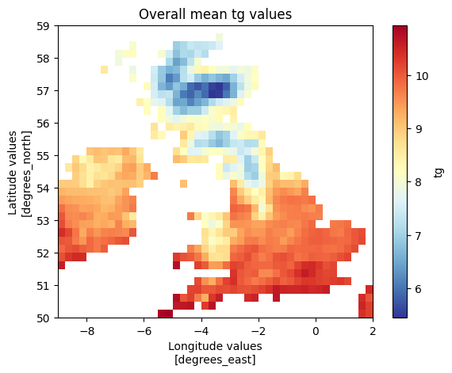

# Simple_climate_package

The open-source Python package **simple_climate_package** reads in netcdf data from E-OBS, performs simple statistical tests and visualises the outputs. 

Statistical tests included in this package:
- Minimum values
- Maximum values
- Mean values
- Climate anomaly values
- Linear regression

# Table of Contents
1. Installation
2. Features
3. Contributions
4. License

# 1. Installation
## Installing without a virtual environment

For general use of this package without a virtual environment, please import using pip install.

```bash 
pip install simple_climate_package
```


## Installation using a virtual environment

To ensure the use of the same packages and dependencies, please follow these steps when setting up your local environment. This method is preferred for developers.

These commands are for bash. 

### Step 1: Clone the repository
```bash
git clone <repo_url>
cd <repo_name>
```

### Step 2: Create and activate a virtual environment
```bash
python3 -m venv env
source env/bin/activate
```

### Step 3: Install dependencies from virtual_environment_requirements.txt
```bash 
pip install -r virtual_environment_requirements.txt
```

## Installing data

This package was developed to work with E-OBS daily gridded mean temperature data from 1950 to present. 

A sample dataset for data over The United Kingdom from 1950 to present can be found in the Data folder located in the simple_climate_package folder.

To use your own data, please copy this code into a script.

```python
import cdsapi

dataset = "insitu-gridded-observations-europe"
request = {
    "product_type": "ensemble_mean",
    "variable": ["mean_temperature"],
    "grid_resolution": "0_25deg",
    "period": "full_period",
    "version": ["30_0e"]
}

client = cdsapi.Client()
client.retrieve(dataset, request).download()
```

# 2. Features
An example analysis script using **simple_climate_package** is listed in the github repository.
Start by specifying the path to you data file.
The data path is an input to many of our methods, so is useful to specify at the beginning of your analysis.

```python
data_path = input('Input the path to the data you want to analyse: ')
```

## Calculating the mean
To conduct analysis using mean data, import the class CalcMean from **simple_climate_package**.
Input the path to your data file into CalcMean and label this as 'tm'.
'tm' is your temperature instance and what will be used to conduct your analysis.

```python
from simple_climate_package.mean import CalcMean


tm = CalcMean(data_path)
```

To obtain the dataset of the mean temperature data for each grid pixel over the entire timeseries, call **mean_tot_time()**.

```python
tm.mean_tot_time()
```

A visualisation of the mean temperature over the entire timeseries can be called using **plot_mean_tot_time()**.

```python
tm.plot_mean_tot_time()
```

This method saves a plot to a filepath specified in the arguement of the method.



Note that **mean_tot_time()** does not need to be called to use **plot_mean_tot_time()**.

Instead of getting the total mean, you can specify the dates between which you want to calculate the mean.

```python
mean_between = tm.mean_between(start_date, end_date)
tm.plot_mean_between(start_date, end_date)
```

To get a dataset for the mean temperature of every grid pixel per year, call **yearly_mean()**.
Calling **plot_yearly_mean()** creates a plot of the mean temperature for every year in the dataset.

```python
yearly_mean = tm.yearly_mean()
tm.plot_yearly_mean()
```
For studying climatology (monthly trends over the entire timeseries), call **monthly_clim()**.
**Monthly_clim()** returns a dataset with 12 values (one per month) representing the long-term monthly climatology.
Calling **tm.plot_monthly_climatology()** plots the climatology for each month.

```python
month_clim = tm.monthly_clim()
tm.plot_monthly_climatology()
```


clim_amon = tm.monthly_clim_Anom()
day_clim = tm.daily_clim()
daily_amon = tm.daily_clim_Anom()


# 3. Authors & Contributions

This package was created by [Hannah-Jane Wood](https://github.com/hannahw0od), [Lucy Harlow](https://github.com/leharlow02-glitch), and [Ofer Cohen](https://github.com/ofer-cohen)

# 4. License
The simple_climate_package is licensed under the [MIT License](LICENSE) - see the LICENSE file for details